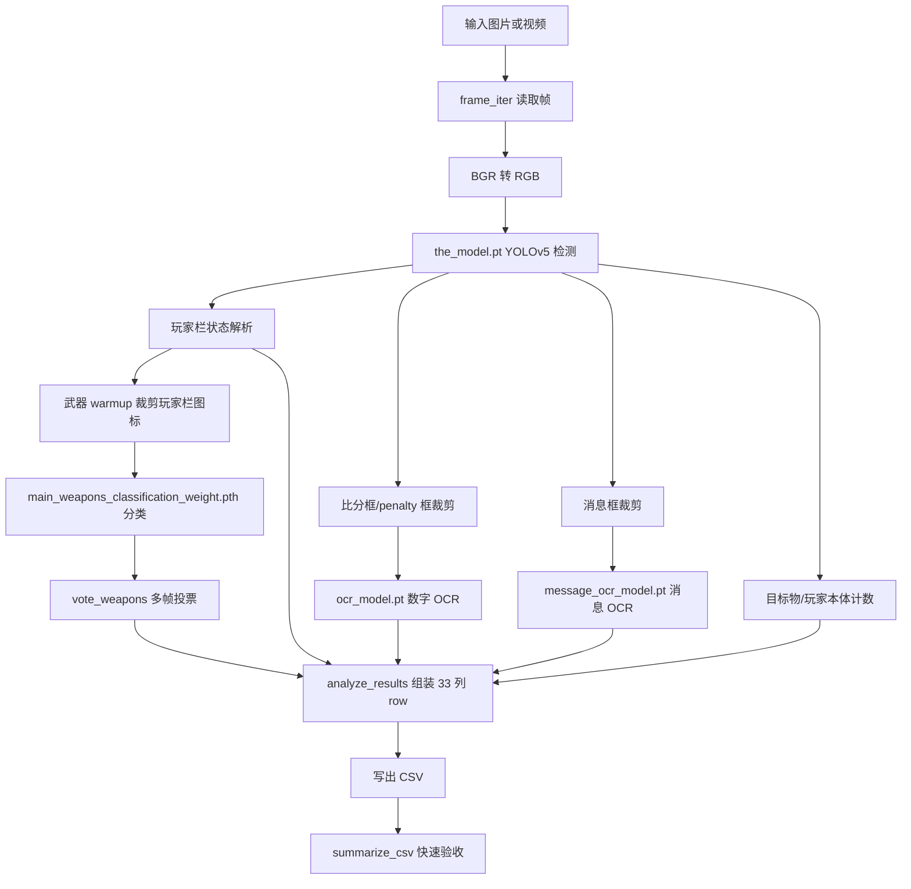
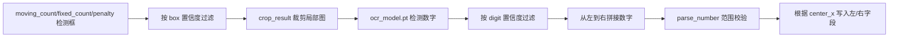

# Splatoon 3 Battle Analysis 项目流程与关键技术点

本文档用于给后续维护者快速建立项目全貌：这个项目要解决什么问题、当前推荐运行路径是什么、视频帧如何转成 CSV 数据、关键模型和函数分别承担什么职责，以及目前哪些能力仍然需要继续验证。

当前推荐主线是 `src/run_analysis.py` 的离线视频分析流程。`src/` 和 `yolov5/` 下还保留了多个历史实时脚本、训练脚本和实验脚本，它们是项目演进记录，不再作为普通分析入口。

## 1. 项目目标

项目目标是分析 Splatoon 3 对战视频或截图，从画面中识别并导出结构化对战状态数据，包括：

- 8 名玩家状态：存活、阵亡、特殊状态等。
- 比分与惩罚计数：左右队伍当前 count 和 penalty。
- 武器名称：通过玩家栏图标裁剪后做分类。
- 规则目标物数量：蛤蜊、鱼虎关门、区域、塔楼关门等。
- 画面消息：通过 message OCR 尝试解析提示文本。
- 玩家本体检测：画面中是否检测到玩家。
- 时间戳和固定 33 列协议字段。

最终输出是 CSV。该 CSV 既能直接用于后续分析，也能被 `src/protocol.py` 转换成 `GameState`，供实时接收/展示路径复用。

## 2. 当前推荐入口

普通分析只使用：

```bash
source scripts/use_local_env.sh
python -m src.run_analysis --input footages/match_1.mp4 --output outputs/match_1.csv --device mps --start-seconds 10 --sample-fps 5
```

常用辅助命令：

```bash
python -m src.run_analysis --input sample/battle.png --output outputs/sample.csv --max-frames 1
python scripts/summarize_csv.py outputs/match_1.csv
```

当前主线文件：

| 文件 | 作用 |
| --- | --- |
| `src/run_analysis.py` | 当前视频/图片分析主入口，负责模型加载、帧循环、检测、OCR、武器分类、CSV 写出。 |
| `scripts/use_local_env.sh` | 激活本地 `.venv`，并把 uv、pip、torch、matplotlib、pycache 等缓存固定到项目内 `.cache`。 |
| `scripts/summarize_csv.py` | 对输出 CSV 做快速统计，确认玩家状态、武器、比分、消息等字段是否有数据。 |
| `RUNNING_MAC_M4.md` | Mac mini M4 上安装和运行命令。 |
| `PROJECT_STATE.md` | 当前恢复状态、验证结果、资产哈希、已知限制。 |

## 3. 目录与资产分工

| 路径 | 内容 |
| --- | --- |
| `models/the_model.pt` | 主 YOLOv5 检测模型，负责识别玩家栏、比分框、消息框、目标物等。 |
| `models/ocr_model.pt` | 数字 OCR 模型，用于比分和 penalty 读数。 |
| `models/message_ocr_model.pt` | 消息 OCR 模型，用于消息框内日文字符识别。 |
| `models/main_weapons_classification_weight.pth` | 武器图标分类模型。 |
| `main_weapon_list.txt` | 武器分类模型输出 index 到武器名的映射。 |
| `footages/` | 本地视频素材，已在 `.gitignore` 中忽略。 |
| `sample/` | 小样例图片。 |
| `outputs/` | CSV 与调试预览帧输出目录，已忽略。 |
| `.venv/` | 项目本地 Python 环境。 |
| `.cache/` | 项目本地缓存，避免占用系统盘。 |
| `yolov5/` | 内置 YOLOv5 vendor/runtime 代码；历史自定义分析脚本已归档到 `legacy/`。 |
| `main_icons/` | 武器图标素材，和武器分类训练/验证相关。 |

## 4. 主流程总览



## 5. `src/run_analysis.py` 核心函数分层

### 5.1 环境与路径

- `ROOT`：始终定位项目根目录，避免从不同工作目录运行时找不到模型。
- 环境变量默认值：`UV_CACHE_DIR`、`PIP_CACHE_DIR`、`TORCH_HOME`、`MPLCONFIGDIR`、`XDG_CACHE_HOME`、`PYTHONPYCACHEPREFIX` 都指向项目内 `.cache`。
- `TORCH_FORCE_NO_WEIGHTS_ONLY_LOAD=1`：兼容旧 `.pt` 权重在 PyTorch 2.6+ 下的加载行为。
- `PYTORCH_ENABLE_MPS_FALLBACK=1`：MPS 遇到不支持算子时允许 fallback。

### 5.2 参数解析

`parse_args()` 定义主要 CLI 参数：

- `--input`：图片或视频输入。
- `--output`：CSV 输出路径。
- `--device auto|cpu|mps`：设备选择。
- `--sample-fps`：视频抽样分析帧率，默认 5 FPS。
- `--start-seconds` / `--stop-seconds`：截取视频区间。
- `--every-frame`：逐帧分析。
- `--max-frames`：烟测时限制分析帧数。
- `--warmup-frames`：武器投票需要的有效 8 人帧数。
- `--preview` / `--save-preview-dir`：实时窗口或保存调试标注图。
- `--count-box-conf`、`--digit-conf`、`--message-box-conf`、`--message-char-conf`：比分和消息 OCR 的置信度阈值。
- `--list-model-names`：打印模型类别名，排查类别映射问题。

### 5.3 设备选择与模型加载

- `choose_device()`：`auto` 时优先使用 MPS；如果请求 MPS 但不可用，则回落 CPU。
- `load_yolo_model()`：通过 `torch.hub.load(..., source="local")` 从本地 `yolov5/` 加载自定义 YOLOv5 权重，不依赖网络。
- `torch_load()`：加载武器分类模型，并兼容 `weights_only=False`。
- `class_ids()`：从 `models/the_model.pt` 的 `detect_model.names` 反查类别 ID，运行时不再把 `yolov5/data.yaml` 当成权威来源。

### 5.4 帧读取

`frame_iter()` 同时支持图片和视频：

- 图片：`cv2.imread()` 后产出单帧。
- 视频：`cv2.VideoCapture()` 打开，按源 FPS 和 `--sample-fps` 计算抽样间隔。
- 支持 `--start-seconds` 跳到指定时间，支持 `--stop-seconds` 截止。
- 每帧产出 `frame_index`、`elapsed_time`、`frame_bgr`。

注意：OpenCV 读取出来是 BGR，而 YOLO 模型输入使用 RGB。因此主循环里先 `cv2.cvtColor(frame_bgr, cv2.COLOR_BGR2RGB)` 再检测；预览绘制仍使用 BGR 帧，避免颜色异常。

### 5.5 主检测模型

主检测模型 `models/the_model.pt` 负责识别这些关键类别：

- `alive`、`dead`、`special`：玩家栏状态。
- `moving_count`、`fixed_count`：比分区域。
- `penalty`：惩罚计数区域。
- `message`：屏幕消息区域。
- `asari_object`、`hoko_canmon`、`area_object`、`yagura_kanmon`：各规则目标物。
- `player`：画面中的玩家本体。

`detections()` 把 YOLOv5 结果转成 numpy array，`by_class()` 按 class id 筛选，后续所有解析都建立在这个检测数组上。

### 5.6 玩家状态解析

`player_lamps()` 会合并 `alive`、`dead`、`special` 三类检测框，并按 x 坐标排序。只有检测到 8 个玩家栏状态时，才认为该帧可以稳定填充 `player_state_1` 到 `player_state_8`，也可以参与武器 warmup。

`center_x()` 用 8 个玩家栏中心估计左右队伍分界。如果当前帧没有稳定的 8 个玩家栏，会退回到画面宽度中线。这会影响比分和 penalty 被分到左队还是右队。

### 5.7 武器分类与 warmup 投票

武器识别分两段：

1. 用主检测模型定位 8 个玩家栏状态框，再从原图裁剪对应区域。
2. 用 `models/main_weapons_classification_weight.pth` 对每个裁剪图做分类，并用 `main_weapon_list.txt` 转成武器名。

关键函数：

- `ImageTransform`：把裁剪图 resize 到 64x64，转 tensor，并 normalize。
- `classify_weapons()`：单帧 8 个位置分别分类。
- `vote_weapons()`：收集前若干个有效 8 人帧，对每个位置做众数投票。

这个设计是为了降低单帧误识别。实际运行时建议从开场或队伍展示附近开始分析，让 warmup 尽量看到清晰稳定的玩家栏图标。如果从中途开始，武器名可能更不稳定。

### 5.8 比分和 penalty OCR

比分解析流程：



关键阈值：

- `--count-box-conf 0.5`
- `--digit-conf 0.5`

这些阈值用于压制低置信度框导致的假比分。当前逻辑允许 `0` 作为合法比分值，并限制比分上界，避免离谱字符串直接进入 CSV。

### 5.9 消息 OCR

消息 OCR 流程：

1. 主检测模型找到 `message` 框。
2. `first_image_for_class()` 按 `--message-box-conf` 过滤后裁剪消息区域。
3. `message_text()` 调用 `models/message_ocr_model.pt` 做字符检测。
4. 用 `MESSAGE_CHARS` 将字符类别 id 映射成日文字符。
5. 按 x 坐标排序后拼接。

默认 `--message-char-conf 0.55` 比较保守，目的是优先避免把低置信单字噪声写进 CSV。消息 OCR 目前仍是弱项，适合作为调试/实验字段，不建议在未验证更多素材前当成完全可靠数据。

### 5.10 CSV 写出

`analyze_results()` 将每一帧转换成固定 33 列 row。最终 `main()` 用 `csv.writer` 写入。

CSV 头由 `CSV_HEADER` 定义，字段顺序与 `src/protocol.py` 的 33 列协议保持一致。

## 6. 33 列数据协议

| 索引 | 字段 | 含义 |
| --- | --- | --- |
| 0 | `elapsed_time` | 视频时间，秒。 |
| 1-8 | `player_state_1` 到 `player_state_8` | 8 名玩家栏状态类别 id。 |
| 9 | `count_left` | 左队 count。 |
| 10 | `count_right` | 右队 count。 |
| 11 | `penalty_left` | 左队 penalty。 |
| 12 | `penalty_right` | 右队 penalty。 |
| 13-20 | `weapon_1` 到 `weapon_8` | 8 名玩家武器名。 |
| 21 | `stage` | 地图名，目前未填充。 |
| 22 | `asari_count` | 蛤蜊目标物数量。 |
| 23 | `hoko_count` | 鱼虎关门数量。 |
| 24 | `area_count` | 区域目标物数量。 |
| 25 | `yagura_count` | 塔楼关门数量。 |
| 26 | `message` | 屏幕消息 OCR 结果。 |
| 27 | `player_detected` | 是否检测到玩家本体。 |
| 28 | `reserved_28` | 预留字段。 |
| 29 | `timestamp` | 分析执行时间。 |
| 30-32 | `reserved_30` 到 `reserved_32` | 预留字段。 |

`src/protocol.py` 中的 `create_game_state()` 会检查输入 list 长度必须为 33，然后映射到 `GameState`。这说明 CSV 协议不是随意格式，而是项目内部通信协议的一部分。

## 7. 实时/通信相关路径

项目里还存在实时接收与展示的雏形：

- `src/protocol.py`：定义 `GameState` 和 `DetectionMessage`。
- `src/receiver.py`：从 multiprocessing queue 接收 list，转换成 `DetectionMessage`，再交给 receiver 处理。
- `src/reduced_receiver.py`：更简化的接收路径。
- `src/dev_realtime_detection.py`、`src/stable_realtime_detection.py`：历史实时检测脚本。

这条路径的核心思想是：检测端把每帧结果整理成 33 列 list，接收端用 `create_game_state()` 转成结构化对象。目前恢复后的稳定主线是离线 CSV 分析；实时路径可以复用协议，但不建议作为当前默认入口。

## 8. 历史脚本与训练脚本

项目历史上有多条实验路径：

- `yolov5/230111_run_analysis.py`、`yolov5/230205_run_analysis_using_pytorchonly.py`：早期离线分析脚本。
- `yolov5/241113_run_analysis_using_*`：后期 PyTorch/CoreML/preview/realtime 尝试。
- `yolov5/241116_realtime.py`、`yolov5/241123_realtime.py`：实时方向实验。
- `230204_*`、`230205_*`、`230206_*`、`241113_*` notebook 和 Python 文件：武器分类数据集制作、训练、推理实验。
- `yolov5/export.py`、`yolov5/model_to_coreml.py`、`yolov5/yolov5-to-coreml.py`：模型导出相关工具。

这些脚本很有参考价值，但它们之间有大量重复函数，例如 OCR、武器分类、batch 处理和 preview 逻辑。当前恢复工作把可运行主线收束到 `src/run_analysis.py`，避免后续继续在多个旧入口之间切换。

## 9. Mac mini M4 运行关键点

### 9.1 本地环境和缓存

由于外置硬盘空间更充裕，环境和缓存都固定在项目目录：

- `.venv`
- `.cache/uv`
- `.cache/pip`
- `.cache/torch`
- `.cache/matplotlib`
- `.cache/pycache`

激活脚本会自动创建这些目录并导出环境变量：

```bash
source scripts/use_local_env.sh
```

这样做有两个好处：

- 不把大体积 Python 包和 torch 缓存写进系统盘。
- 避免 Python 字节码缓存写到 macOS 默认 cache 目录时触发权限或沙箱问题。

### 9.2 MPS

`--device auto` 会优先使用 MPS；也可以显式传 `--device mps`。

注意：Codex 沙箱中可能看不到 MPS，因此 MPS 验证需要在沙箱外运行。普通 Terminal 中只要 `torch.backends.mps.is_available()` 为 true，就会走 Apple Silicon GPU 路径。

### 9.3 PyTorch 2.6+ 权重加载

旧 YOLOv5 `.pt` 模型在较新 PyTorch 中可能受到 `weights_only` 默认行为影响。项目通过：

```bash
TORCH_FORCE_NO_WEIGHTS_ONLY_LOAD=1
```

以及 `torch_load(..., weights_only=False)` 来保证旧权重能正常加载。

## 10. 调试与验收方式

### 10.1 快速 smoke test

```bash
python -m src.run_analysis --input sample/battle.png --output outputs/sample.csv --max-frames 1
```

用于验证环境、模型加载、单图检测、CSV 写出是否正常。

### 10.2 短视频 smoke test

```bash
python -m src.run_analysis --input footages/match_1.mp4 --output outputs/match_1_smoke.csv --device mps --start-seconds 10 --sample-fps 5 --max-frames 40
python scripts/summarize_csv.py outputs/match_1_smoke.csv
```

用于验证视频读取、MPS、warmup、比分 OCR、CSV 汇总。

### 10.3 保存预览帧

```bash
python -m src.run_analysis --input footages/match_1.mp4 --output outputs/probe.csv --device mps --start-seconds 22.4 --sample-fps 5 --max-frames 10 --save-preview-dir outputs/previews_probe
```

用于查看检测框是否落在正确位置，排查假比分、消息噪声或类别混淆。

### 10.4 查看模型类别

```bash
python -m src.run_analysis --input sample/battle.png --list-model-names
```

用于确认运行时类别来自模型自身，而不是旧的 `data.yaml`。

## 11. 已验证基线

当前记录在 `PROJECT_STATE.md` 的验证基线：

- `footages/match_1.mp4`，10 到 150 秒，5 FPS。
- 设备：`mps`。
- 输出：`outputs/match_1_analysis_10_150_mps_final.csv`。
- 行数：701。
- 8 人状态行：531。
- 武器行：677。
- 比分行：551。
- 目标物行：587。
- 玩家检测行：96。
- 消息行：0。

这说明当前主线已经能在 Mac mini M4 上完整跑通，并输出可用于后续分析的数据。但这仍是一个视频片段上的基线，不代表所有规则、地图、UI 状态都已经充分覆盖。

## 12. 当前已知限制

- `stage` 字段暂未填充。
- 消息 OCR 保守，默认更偏向不输出，也不写低置信噪声。
- 武器分类依赖开局/队伍展示附近的有效 8 人帧，多帧投票能降低但不能完全消除误识别。
- 左右队伍分界依赖玩家栏或画面中线；如果画面 UI 被遮挡，比分左右归属可能受影响。
- 当前阈值主要基于 `match_1.mp4` 调整，更多视频、规则、地图和画质仍需验证。
- 历史脚本很多，后续开发应优先扩展 `src/run_analysis.py`，避免继续分叉出新入口。

## 13. 后续维护建议

优先级建议如下：

1. 用更多完整对局视频跑 `src/run_analysis.py`，记录每个字段的准确率。
2. 给 `scripts/summarize_csv.py` 增加更细的异常统计，例如 count 跳变、weapon 空洞、玩家状态缺失区间。
3. 如果要恢复 `stage`，先明确 stage 模型或画面区域，再接入 CSV 第 21 列。
4. 对消息 OCR 建立小型标注集，再决定是否降低阈值或重训模型。
5. 把历史脚本中仍有价值的逻辑逐步迁移为可测试的小函数，而不是继续直接运行旧脚本。
6. 如果要做实时展示，把 `src/protocol.py` 的 `GameState` 作为唯一协议层，离线 CSV 和实时 queue 都遵守同一 33 列结构。

## 14. 一句话架构总结

这个项目本质上是一条视觉识别流水线：OpenCV 抽帧，YOLOv5 做 UI/目标物检测，专用 OCR 模型读数字和消息，PyTorch 分类模型识别武器，再把每帧结果规整成固定 33 列协议 CSV。当前稳定入口是 `src/run_analysis.py`，历史脚本保留为参考，不再作为默认运行路径。
